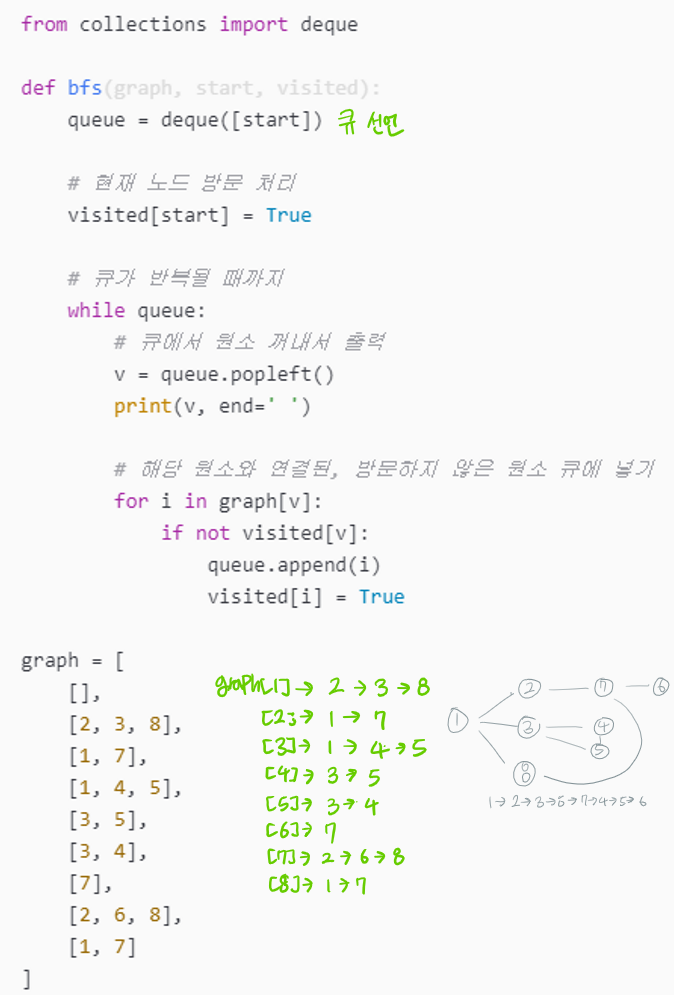
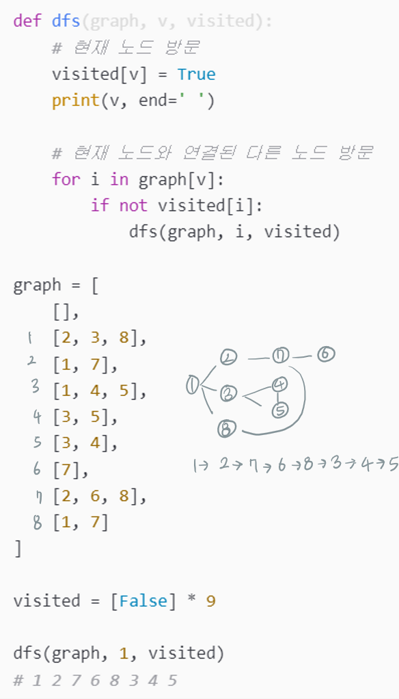

# BFS DFS란?
그래프 탐색 기법
목적 : 임의의 한 정점에서 시작하여 모든 정점을 방문

BFS: Breadth First Search, 너비 우선 탐색
간선의 가중치가 모두 같을 때, 최단 거리를 구하는 알고리즘
시작 정점을 기준으로 가까운 정점을 먼저 방문한다 (방문 순서 -> 최단거리에 영향)
큐를 이용한다 = 선입선출의 원칙으로 탐색한다

DFS: Depth First Search, 깊이 우선 탐색
단, 최단 거리가 아닐 수 있다
