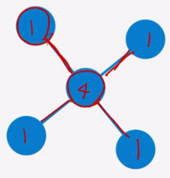
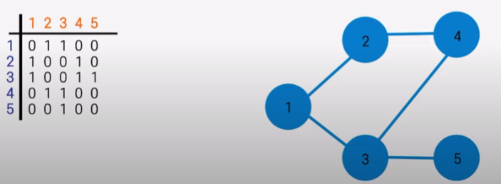
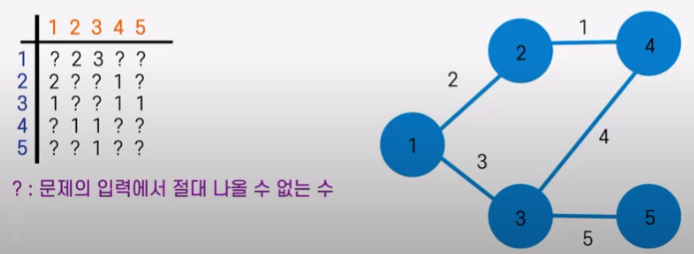

# 그래프
정점과 간선(단방향, 양방향)들로 이루어진 집합을 말한다

### 기초 용어 정리
* 차수 : 어떤 정점의 차수, 어떤 꼭지점의 차수

* 사이클 : 하나의 사이클을 만드는 것 (보통 단방향으로 문제 나옴)
* 경로 : 정점에서 다른 정점으로 가는 경로(보통 가장 빠른 경로를 찾으라고 함)
* 가중치: 간선마다 가지고 있는 고유값(문제에 따라 거리, 비용 등 다양한 값을 갖는다)

### 그래프 표현 방법
* 인접 행렬
정점의 개수 n개에 대해 nXn 행렬(배열)을 이용하여 표현한다
V[i][j]:i번 노드 ~ j번 노드를 잇는 간선의 여부 확인(1:있음 0:없음)

가중치가 있는경우

ex. 양수 -> -1

* 인접 리스트
가변길이의 벡터를 통해 구현한다
정점 N개인 그래프의 인접 리스트 초기 선언 - vector<int>[N]
V[i] = {i와 연결되어 있는 모든 정점}

### 공간 복잡도
* 인접 행렬 : NxN 행렬 사용 -> O(N^2)
* 인접 리스트 : 간선 개수 x2 공간 필요 -> O(E)
-> 인접 리스트가 훨씬 효율적