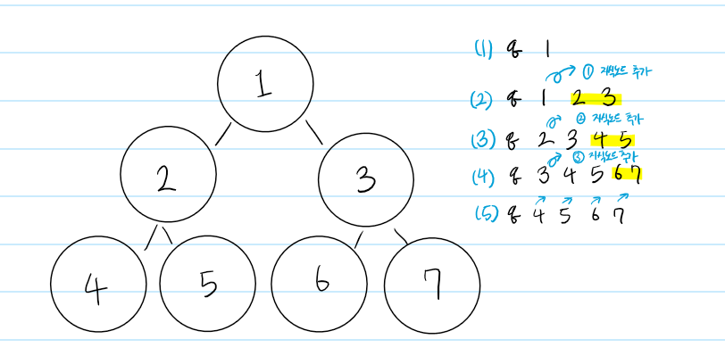
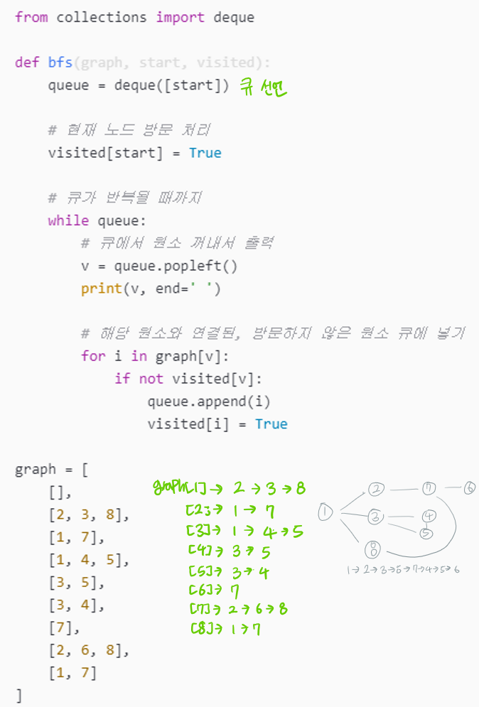
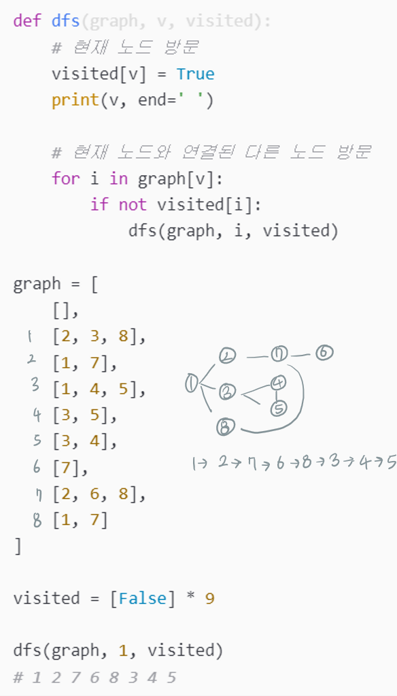

# BFS DFS란?
탐색: 많은 양의 데이터 중에서 원하는 데이터를 찾는 과정
그래프 탐색 기법
목적 : 임의의 한 정점에서 시작하여 모든 정점을 방문

### BFS: Breadth First Search, 너비 우선 탐색
* 큐 자료구조를 이용한다(선입선출의 원칙으로 탐색)
* 간선의 가중치가 모두 같을 때, 최단 거리를 구하는 알고리즘
시작 정점을 기준으로 가까운 정점을 먼저 방문한다 (방문 순서 -> 최단거리에 영향)
1. 탐색 노드를 큐에 삽입하고 방문처리를 합니다
2. 큐에서 노드를 꺼낸 뒤에 해당 노드의 인접 노드 중에서 방문하지 않은 노드를 모두 큐에 삽입하고 방문처리합니다
3. 더 이상 2번의 과정을 수행할 수 없을 때까지 반복합니다



### DFS: Depth First Search, 깊이 우선 탐색
* 스택 자료구조(혹은 재귀함수)를 이용한다
* 단, 최단 거리가 아닐 수 있다
1. 탐색 노드를 스택에 삽입하고 방문처리를 합니다
2. 스택의 최상단 노드에 방문하지 않은 인접한 노드가 하나라도 있으면 그 노드를 스택에 넣고 방문 처리합니다 방문하지 않은 인접노드가 없으면 스택에서 최상단 노드를 꺼냅니다
3. 더 이상 2번의 과정을 수행할 수 없을 때까지 반복합니다


### 정리

```python
# ✔ 문제 유형
"""
dfs
- 사이클
- 경로 찾기
bfs
- 최단 거리
"""

# ✔ 상하좌우 움직이기
direction =[[-1,0],[1,0],[0,-1],[0,1]]
for d in direction:
    dx=now[0]+d[0]
    dy=now[1]+d[1]
    if 범위확인해야함

# ✔ 부분수열 만들기(중복이 불가능하고 순서가 의미없는)
def solution(v):

    # 현재 인덱스(v)부터 배열 끝까지 반복
    for i in range(v,N):
        arr.append(N_list[i])  # 현재 원소를 부분집합에 추가
        solution(i+1)          # 재귀 호출: 다음 원소로 진행
        arr.pop()              # 현재 원소를 부분집합에서 제거

# ✔ 우선순위 (이동 방법 중 우선순위를 줘야 하는것 ex) 빈방 먼저, 0초 이동)
"""우선순위를 줘야하는 것은 큐에 추가할 때 왼쪽에 추가한다"""
def bfs():
    # 큐를 초기화하고 시작점을 추가
    queue = deque()
    queue.append([0, 0, 0])  # [x좌표, y좌표, 현재까지 부신 벽 개수]
    visited[0][0] = 1

    while queue:
        n_x, n_y, n = queue.popleft()
        
        # 네 방향으로 이동
        for i in location:
            b_x = n_x + i[0]
            b_y = n_y + i[1]
                
            # 0인 경우에는 큐의 왼쪽에 추가하여 최소 이동 횟수로 탐색
            if map_list[b_x][b_y] == 0:
                queue.appendleft([b_x, b_y, n])
            # 1인 경우에는 큐의 오른쪽에 추가하여 벽을 부수고 탐색
            else:
                queue.append([b_x, b_y, n + 1])

# ✔ 목적지 까지의 최소 시간
"""최소시간을 찾는 문제는 bfs()를 써야하고 
방문 확인하는 배열에 +1 해주면서 이동하면 된다
이미 방문한 곳은 가지 않는다 """
visited[n + 1] = visited[n] + 1

# ✔ 인접한 노드가 서로 다른 집합이어야 할 때
"""1707. 풀이 확인: visited를 통해 집합을 표현"""

# ✔ 연결된 집단의 개수
from collections import deque

def bfs(v, computers, visited):
    q=deque([v])
    visited[v]=1

    while q:
        now=q.popleft()
        for i in range(len(computers)):
            if now!=i and computers[now][i]==1 and visited[i]==0:
                visited[i]=1
                q.append(i)


def solution(n, computers):
    answer = 0

    visited=[0 for _ in range(n)]

    for x in range(n):
        if visited[x]==0:
            bfs(x,computers,visited)
            answer+=1 #핵심

    return answer

# ✔ 최소 거리를 찾은 후 경로 
"""해당 정점을 방문했을 때 부모노드를 저장해줬다"""
parent = [-1 for _ in range(max_num)]
while parent[n] != -1:#목적지 도착했을 때 경로 출력하는 법
    result.append(n)
    n = parent[n]

# ✔ 경로가 겹쳐 오류가 난다면
"""큐에 넣어준다 [정점, 경로]"""
```