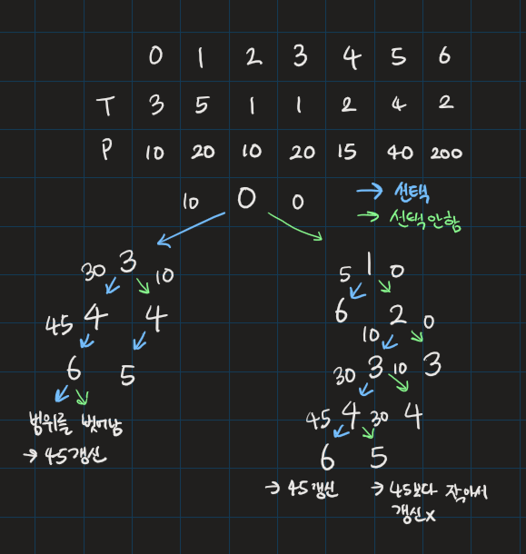

# 퇴사

## 💡**문제 분석 요약**

시간제한 2초
메모리 제한 512MB

상담원으로 일하고 있는 백준이는 퇴사를 하려고 한다.
오늘부터 N+1일째 되는 날 퇴사를 하기 위해서, 남은 N일 동안 최대한 많은 상담을 하려고 한다.
백준이는 비서에게 최대한 많은 상담을 잡으라고 부탁을 했고, 비서는 하루에 하나씩 서로 다른 사람의 상담을 잡아놓았다.
각각의 상담은 상담을 완료하는데 걸리는 기간 Ti와 상담을 했을 때 받을 수 있는 금액 Pi로 이루어져 있다.

N = 7인 경우에 다음과 같은 상담 일정표를 보자.
```
    1일	2일	3일	4일	5일 6일	7일
Ti	3	5	1	1	2	4	2
Pi	10	20	10	20	15	40	200
```
1일에 잡혀있는 상담은 총 3일이 걸리며, 상담했을 때 받을 수 있는 금액은 10이다. 5일에 잡혀있는 상담은 총 2일이 걸리며, 받을 수 있는 금액은 15이다.
상담을 하는데 필요한 기간은 1일보다 클 수 있기 때문에, 모든 상담을 할 수는 없다. 
예를 들어서 1일에 상담을 하게 되면, 2일, 3일에 있는 상담은 할 수 없게 된다. 
2일에 있는 상담을 하게 되면, 3, 4, 5, 6일에 잡혀있는 상담은 할 수 없다.

또한, N+1일째에는 회사에 없기 때문에, 6, 7일에 있는 상담을 할 수 없다.

퇴사 전에 할 수 있는 상담의 최대 이익은 1일, 4일, 5일에 있는 상담을 하는 것이며, 이때의 이익은 10+20+15=45이다.

상담을 적절히 했을 때, 백준이가 얻을 수 있는 최대 수익을 구하는 프로그램을 작성하시오.

입력
첫째 줄에 N (1 ≤ N ≤ 15)이 주어진다.
둘째 줄부터 N개의 줄에 Ti와 Pi가 공백으로 구분되어서 주어지며, 1일부터 N일까지 순서대로 주어진다. (1 ≤ Ti ≤ 5, 1 ≤ Pi ≤ 1,000)

출력
첫째 줄에 백준이가 얻을 수 있는 최대 이익을 출력한다.

## 💡**알고리즘 설계**

* 왼쪽에서 오른쪽으로 이동하면서 해당 날의 상담을 진행할 것인지 아닌지 선택하면 된다
* 선택한다면 v+T[v] <= N이라면 그동안 합쳐진 돈 + 해당 날의 돈을 넘겨준다
  * 이때 왜 v+T[v] < N이 아니냐면 하루만에 끝내는 경우도 있기 때문
* 선택하지 않는다면 v+1, 그동안 합쳐진 돈을 넘겨준다
* v가 N보다 크거나 같다면 지금까지 더해진 값과 현재 저장된 값 중에 큰 값을 골라 저장한다

## 💡코드

```python

import sys

def dfs(v, m):
    global ans
    
    # 만약 v가 N 이상이라면 모든 노드를 방문한 것이므로 최댓값 갱신 후 종료
    if v >= N:
        ans = max(ans, m)
        return
    
    # 현재 노드를 방문하는 경우
    if v + N_list[v][0] <= N:
        dfs(v + N_list[v][0], m + N_list[v][1])
    
    # 현재 노드를 방문하지 않는 경우
    dfs(v + 1, m)

# 입력: 정수 N
N = int(sys.stdin.readline())

# 입력: N개의 노드 정보를 담은 2차원 리스트 N_list
N_list = [list(map(int, sys.stdin.readline().strip().split())) for _ in range(N)]

# 초기값 설정
ans = 0

# DFS 함수 호출
dfs(0, 0)

# 최종 결과 출력
print(ans)

```

## 💡시간복잡도
각 노드마다 두 가지 선택지(방문하거나 방문하지 않거나)가 있으므로 O(2^N)

## 💡 틀린 이유


## 💡 다른 풀이

```python

```

## 💡 느낀점 or 기억할정보
1. 꼭 for문을 돌려서 정점을 방문하지 않아도 된다
2. 이런 방법이 있는 줄 몰랐다 기억하자