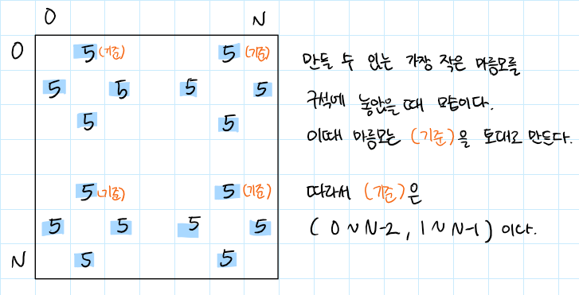
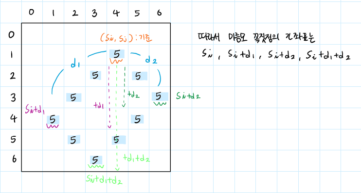
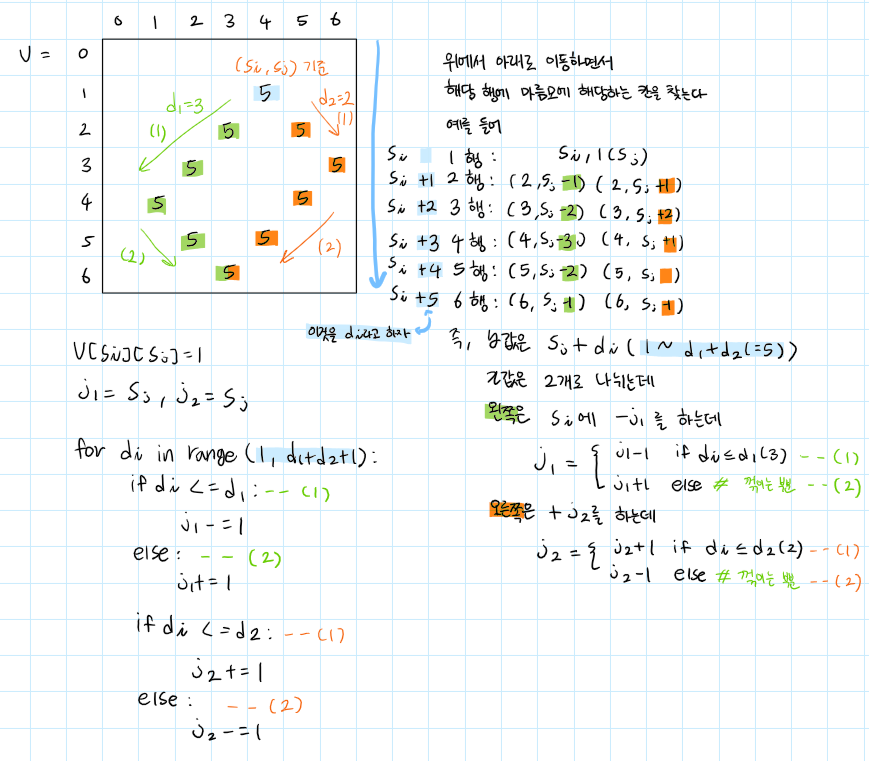
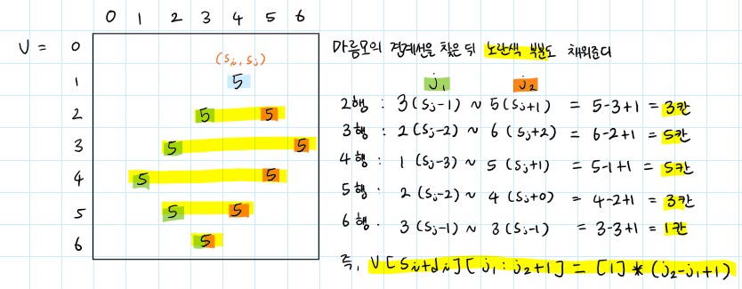
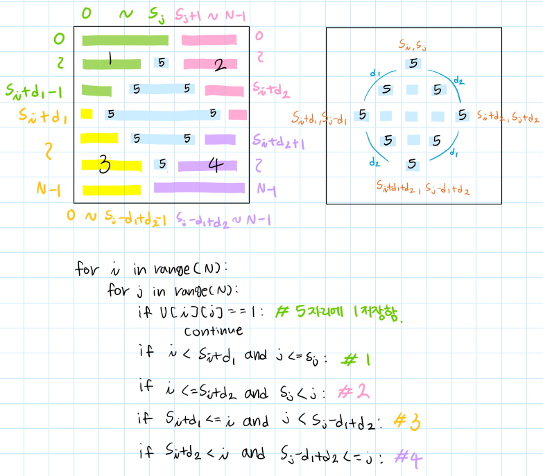

# 개리멘더링 2

## 💡문제 분석 요약
```
시간제한 1초
메모리 제한 512MB

재현시의 시장 구재현은 지난 몇 년간 게리맨더링을 통해서 자신의 당에게 유리하게 선거구를 획정했다. 
견제할 권력이 없어진 구재현은 권력을 매우 부당하게 행사했고, 심지어는 시의 이름도 재현시로 변경했다. 
이번 선거에서는 최대한 공평하게 선거구를 획정하려고 한다.

재현시는 크기가 NxN인 격자로 나타낼 수 있다. 
격자의 각 칸은 구역을 의미하고, r행 c열에 있는 구역은 (r, c)로 나타낼 수 있다. 
구역을 다섯 개의 선거구로 나눠야 하고, 각 구역은 다섯 선거구 중 하나에 포함되어야 한다. 
선거구는 구역을 적어도 하나 포함해야 하고, 한 선거구에 포함되어 있는 구역은 모두 연결되어 있어야 한다. 
구역 A에서 인접한 구역을 통해서 구역 B로 갈 수 있을 때, 두 구역은 연결되어 있다고 한다. 
중간에 통하는 인접한 구역은 0개 이상이어야 하고, 모두 같은 선거구에 포함된 구역이어야 한다.

선거구를 나누는 방법은 다음과 같다.

기준점 (x, y)와 경계의 길이 d1, d2를 정한다. (d1, d2 ≥ 1, 1 ≤ x < x+d1+d2 ≤ N, 1 ≤ y-d1 < y < y+d2 ≤ N)
다음 칸은 경계선이다.
(x, y), (x+1, y-1), ..., (x+d1, y-d1)
(x, y), (x+1, y+1), ..., (x+d2, y+d2)
(x+d1, y-d1), (x+d1+1, y-d1+1), ... (x+d1+d2, y-d1+d2)
(x+d2, y+d2), (x+d2+1, y+d2-1), ..., (x+d2+d1, y+d2-d1)

경계선과 경계선의 안에 포함되어있는 곳은 5번 선거구이다.
5번 선거구에 포함되지 않은 구역 (r, c)의 선거구 번호는 다음 기준을 따른다.
1번 선거구: 1 ≤ r < x+d1, 1 ≤ c ≤ y
2번 선거구: 1 ≤ r ≤ x+d2, y < c ≤ N
3번 선거구: x+d1 ≤ r ≤ N, 1 ≤ c < y-d1+d2
4번 선거구: x+d2 < r ≤ N, y-d1+d2 ≤ c ≤ N

아래는 크기가 7x7인 재현시를 다섯 개의 선거구로 나눈 방법의 예시이다.
```
## 💡문제 정리
* 만들 수 있는 마름모들에 대해서 탐색
* 마름모 만들기
* 마름모를 기준으로 1,2,3,4,5 선거구의 인구를 구한다
  * 최대 인구 - 최소인구 의 차이가 가장 작은 것을 고른다

## 💡알고리즘 설계
### 마름모 생성 위치

  

### 마름모 꼭짓점

  

### 마름모 경계선

  

### 마름모 채우기

  

### 1,2,3,4 선거구 찾기

  

## 💡코드

```python
import sys

def line(si, sj, d1, d2):
    # 5번 구역 체크하기 위한 배열 초기화
    v = [[0] * N for _ in range(N)]
    ans = [0] * 5  # 각 구역의 인구 수를 담을 배열 초기화

    # 5번 구역 모두 확인하며 해당 영역을 1로 표시
    v[si][sj] = 1
    j1 = j2 = sj
    for di in range(1, d1 + d2 + 1):
        if di <= d1:
            j1 -= 1
        else:
            j1 += 1
        if di <= d2:
            j2 += 1
        else:
            j2 -= 1
        # 해당 영역을 1로 표시
        v[si + di][j1:j2 + 1] = [1] * (j2 - j1 + 1)

    # 1, 2, 3, 4 구역의 인구수 누적
    for i in range(N):
        for j in range(N):
            if v[i][j] == 1:
                continue
            if i < si + d1 and j <= sj:  # 1번 구역
                ans[0] += A[i][j]
            elif i <= si + d2 and sj < j:  # 2번 구역
                ans[1] += A[i][j]
            elif si + d1 <= i and j < sj - d1 + d2:  # 3번 구역
                ans[2] += A[i][j]
            elif si + d2 < i and sj - d1 + d2 <= j:  # 4번 구역
                ans[3] += A[i][j]
        
    # 5번 구역의 인구수 계산
    ans[4] = total - sum(ans)
    return max(ans) - min(ans)  # 인구수의 최대 차이 반환
    

N = int(sys.stdin.readline())  # 지도의 크기 입력
A = [list(map(int, sys.stdin.readline().strip().split())) for _ in range(N)]  # 지도 정보 입력
result = 400000  # 결과를 저장할 변수 초기화
total = sum(map(sum, A))  # 전체 인구 수 계산

# 모든 가능한 경계선을 설정하고 최소 인구 차이 구하기
for x in range(N - 2):
    for y in range(1, N - 1):
        for d1 in range(1, N - 1):
            for d2 in range(1, N - 1):
                # 경계선이 지도 내부에 있는지 확인
                if 0 <= x + d1 - 1 < N and 0 <= x + d2 - 1 < N and 0 <= y - d1 + d2 - 1 < N:
                    if 0 <= y - d1 and y + d2 < N and x + d1 + d2 < N:
                        # 각 경우에 대해 최소 인구 차이 갱신
                        result = min(result, line(x, y, d1, d2))

print(result)  # 결과 출력

```

## 💡시간복잡도

## 💡 틀린 이유
dfs와 bfs를 사용했는데 bfs는 신경쓸게 너무 많아 스파게티 코드가 되었다

## 💡 다른 풀이

```python

```

## 💡 느낀점 or 기억할정보
마름모 만들기 설계한거 확인 그리고 구역 찾기도