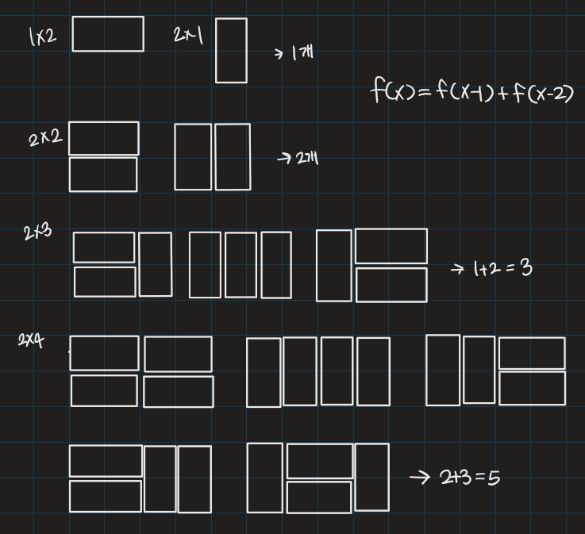

# 2×n 타일링

## 💡**문제 분석 요약**

시간제한 1초
메모리제한 256MB

2xn 크기의 직사각형을 1x2, 2x1 타일로 채우는 방법의 수를 구하는 프로그램을 작성하시오.
아래 그림은 2x5 크기의 직사각형을 채운 한 가지 방법의 예이다.

입력
첫째 줄에 n이 주어진다. (1<=n<=1000)

출력
첫째 줄에 2xn 크기의 직사각형을 채우는 방법의 수를 10007로 나눈 나머지를 출력한다

## 💡**알고리즘 설계**


## 💡코드

```python

import sys

# 다이나믹 프로그래밍 함수
def dp(x):
    # 이미 계산된 값이 있다면 해당 값을 반환
    if tmp[x] != 0:
        return tmp[x]
    else:
        # 계산 결과를 저장하고 반환
        tmp[x] = dp(x - 1) + dp(x - 2)
        return tmp[x]

# 입력으로부터 정수 N을 받음
N = int(sys.stdin.readline())

# 계산된 값을 저장할 리스트 초기화
tmp = [0 for _ in range(1001)]
tmp[1] = 1
tmp[2] = 2

# dp 함수 호출 결과를 10007로 나눈 나머지 출력
print(dp(N) % 10007)

```

## 💡시간복잡도
O(N)

## 💡 틀린 이유                     

## 💡 다른 풀이
어차피 비슷하지만 좀 더 간단하게 만들 수 있는 방법이다
```python
n = int(input())
arr = [0, 1, 2]

for i in range(3, n+1):
    arr.append(arr[i-1] + arr[i-2])
    
print(arr[n] % 10007)
```

## 💡 느낀점 or 기억할정보
연산이 중복된다면 메모리에 저장하는 방법도 있다