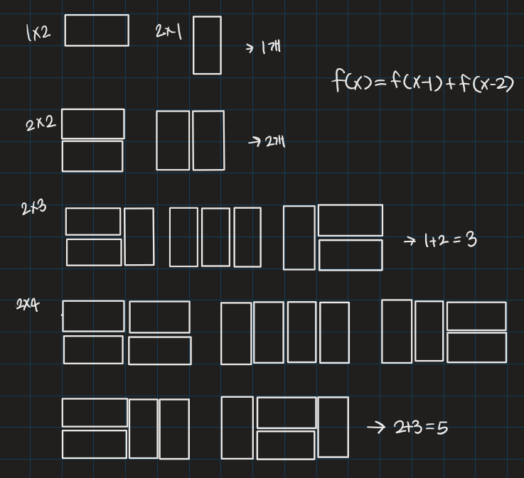

# 2×n 타일링 2

## 💡**문제 분석 요약**

시간제한 1초
메모리제한 256MB

2xn 직사각형을 1x2, 2x1과 2x2 타일로 채우는 방법의 수를 구하는 프로그램을 작성하시오.
아래 그림은 2x17 직사각형을 채운 한가지 예이다.

입력
첫째 줄에 n이 주어진다. (1 ≤ n ≤ 1,000)

출력
첫째 줄에 2xn 크기의 직사각형을 채우는 방법의 수를 10,007로 나눈 나머지를 출력한다.

## 💡**알고리즘 설계**

## 💡코드

```python

# sys 모듈을 사용하여 입력을 받습니다.
import sys

# 정수 n을 입력 받습니다.
n = int(sys.stdin.readline())

# 초기값으로 arr 리스트를 설정합니다.
arr = [0, 1, 3]

# 3부터 n까지의 값을 구하는 반복문입니다.
for i in range(3, n+1):
    # 점화식을 사용하여 arr[i]를 계산합니다.
    arr.append(arr[i-1] + arr[i-2]*2)

# 결과를 출력합니다. 10007로 나눈 나머지를 출력합니다.
print(arr[n] % 10007)


```

## 💡시간복잡도
O(N)

## 💡 틀린 이유                     

## 💡 다른 풀이

## 💡 느낀점 or 기억할정보
