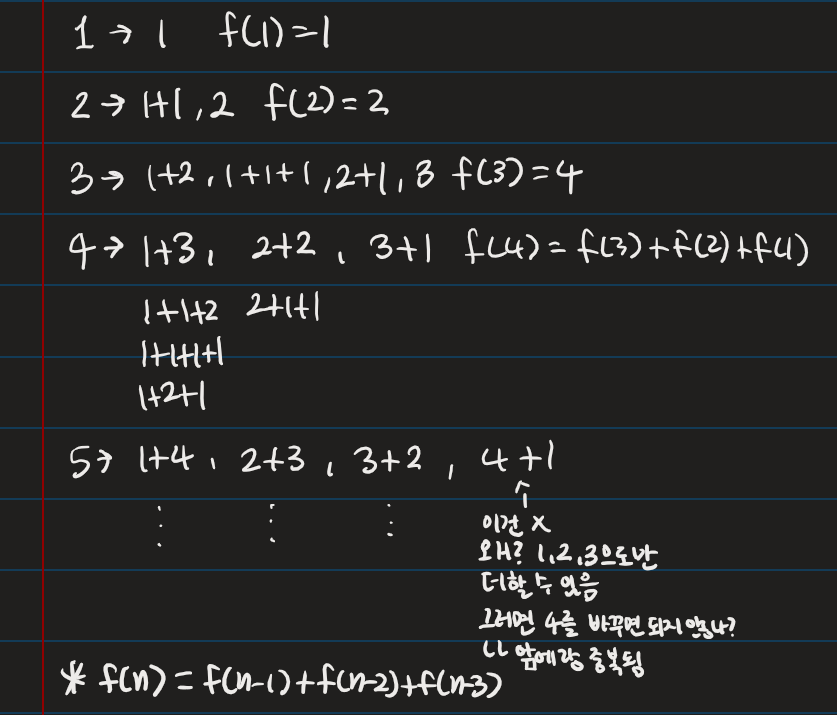
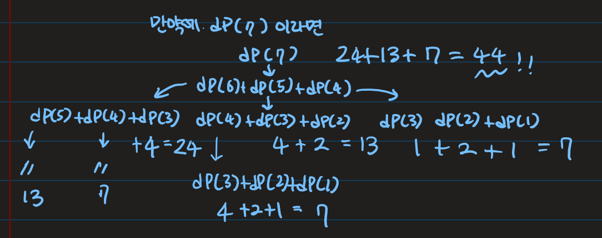

# 1,2,3 더하기

## 💡**문제 분석 요약**

시간제한 1초
메모리제한 512MB

정수 4를 1, 2, 3의 합으로 나타내는 방법은 총 7가지가 있다. 합을 나타낼 때는 수를 1개 이상 사용해야 한다.

1+1+1+1
1+1+2
1+2+1
2+1+1
2+2
1+3
3+1
정수 n이 주어졌을 때, n을 1, 2, 3의 합으로 나타내는 방법의 수를 구하는 프로그램을 작성하시오.

입력
첫째 줄에 테스트 케이스의 개수 T가 주어진다. 각 테스트 케이스는 한 줄로 이루어져 있고, 정수 n이 주어진다. n은 양수이며 11보다 작다.

출력
각 테스트 케이스마다, n을 1, 2, 3의 합으로 나타내는 방법의 수를 출력한다.

## 💡**알고리즘 설계**



## 💡코드

```python

import sys

# 재귀적 다이나믹 프로그래밍 함수
def dp(x):
    if x == 1:
        return 1
    elif x == 2:
        return 2
    elif x == 3:
        return 4
    else:
        # 현재 수를 만들기 위해 바로 이전 3개의 수의 합을 반환
        return dp(x-1) + dp(x-2) + dp(x-3)

# 입력 받을 횟수 N
N = int(sys.stdin.readline())

# N번의 입력에 대해 dp 함수 결과 출력
for _ in range(N):
    # 각 입력에 대해 dp 함수 호출하여 결과 출력
    print(dp(int(sys.stdin.readline())))

```

## 💡시간복잡도
O(3^N) dp(x-1) + dp(x-2) + dp(x-3)에서 재귀적으로 반복하기 때문
더 효율적인 방법은 밑에서 다룬다

## 💡 틀린 이유


## 💡 다른 풀이
손으로 과정을 그리다보니 연산이 중복되는 부분이 있다는 것을 발견하였고 이로인해 시간복잡도가 크게 나온다
그래서 밑에와 갈이 이미 계산한 것을 저장해두는 방법을 사용하면 중복된 연산을 피할 수 있으면
시간복잡도는 O(N)으로 더 효율적이라는 것을 알 수 있다
```python
import sys
# 한 줄씩 입력을 받기 위한 함수
read = sys.stdin.readline

# 정수 n을 1, 2, 3의 합으로 나타내는 방법의 수를 계산하는 함수
def findWays(n):
    # 이미 계산된 값이 있다면 해당 값을 반환
    if ways[n] != 0:
        return ways[n]
    tot = 0
    # 1, 2, 3 중 최대 3번까지 재귀적으로 호출하여 경우의 수 누적
    for i in range(1, 4 if n > 2 else n + 1):
        tot += findWays(n - i)
    # 계산된 결과를 ways 리스트에 저장
    ways[n] = tot
    return tot

# 테스트 케이스의 수 입력
T = int(read())
# 1부터 10까지의 정수에 대한 경우의 수를 저장하는 리스트 초기화
ways = [1] * 2 + [0] * 9

# 각 테스트 케이스에 대해 결과 출력
for _ in range(T):
    # 입력으로 주어진 정수에 대해 findWays 함수 호출
    n = int(read())
    findWays(n)
    # 결과 출력
    print(ways[n])
```

## 💡 느낀점 or 기억할정보
연산이 중복된다면 메모리에 저장하는 방법도 있다