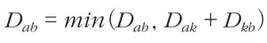

# floyd warshall
* 모든 노드에서 다른 모든 노드까지의 최단 뎡로를 모두 게산합니다
* 플로이드 워셜 알고리즘은 다익스트라 알고리즘과 마찬가지고 단계별로 거쳐 가는 노드를 기준으로 알고리즘을 수행합니다
  * 다만 매 단계마다 방문하지 않은 노드 중에 최단 거리를 갖는 노드를 찾는 과정이 필요하지 않습니다
* 플로이드 워셜을 2차원 테이블에 최단 거리 정보를 저장합니다
* 플로이드 워셜 알고리즘은 다이나믹 프로그래밍 유형에 속합니다
* 다익스트라는 하나의 정점에서 다른 모든 정점까지의 최단거리를 구하는 알고리즘이지만 프로이드 워셜은 모든 노드간 최단 경로를 구하기 위함이다

### 점화식

* 각 단계마다 특정한 노드 K를 거쳐 가는 경우를 확인합니다
  * a에서 b로 가는 최단 거리보다 a에서 K를 거쳐 b로 가는 거리가 더 짧은지 검사합니다

### 코드
```python
INF = int(1e9) # 무한을 의미하는 값으로 10억을 설정

# 노드의 개수 및 간선의 개수를 입력받기
n = int(input())
m = int(input())
# 2차원 리스트(그래프 표현)를 만들고, 모든 값을 무한으로 초기화
graph = [[INF] * (n + 1) for _ in range(n + 1)]

# 자기 자신에서 자기 자신으로 가는 비용은 0으로 초기화
for a in range(1, n + 1):
    for b in range(1, n + 1):
        if a == b:
            graph[a][b] = 0

# 각 간선에 대한 정보를 입력 받아, 그 값으로 초기화
for _ in range(m):
    # A에서 B로 가는 비용은 C라고 설정
    a, b, c = map(int, input().split())
    graph[a][b] = c 

# 점화식에 따라 플로이드 워셜 알고리즘을 수행
for k in range(1, n + 1):
    for a in range(1, n + 1):
        for b in range(1, n + 1):
            graph[a][b] = min(graph[a][b], graph[a][k] + graph[k][b])

# 수행된 결과를 출력
for a in range(1, n + 1):
    for b in range(1, n + 1):
        # 도달할 수 없는 경우, 무한(INFINITY)이라고 출력
        if graph[a][b] == 1e9:
            print("INFINITY", end=" ")
        # 도달할 수 있는 경우 거리를 출력
        else: 
            print(graph[a][b], end=" ")
    print()
```
#### 💡 궁금했던 점
* 저렇게 돌리면 갱신 하지 않아도 되는 경우(자기 자신으로 들어오는)는 어카지?
  * 결과만 얘기하면 0이 저장되어있으므로 "상관 없다"이다
  * k는 1일 때, a,b도 1이라면..? 어차피 다 0이라서 상관없다
  * 그럼 k는 1일 때, a,b가 2라면..? 2에서2로 가는 것이 0이므로 어차피 0으로 갱신 상관없다


### 성능
* 노드의 개수가 N개일 때, 알고리즘 상으로 N번의 단계를 수행합니다
  * 각 단계마다 O(N^2)의 연산을 통해 현재 노드를 거쳐가는 모든 경로를 고려합니다
* 따라서 플로이드 워셜 알고리즘의 총 시간 복잡도는 O(N^3)입니다