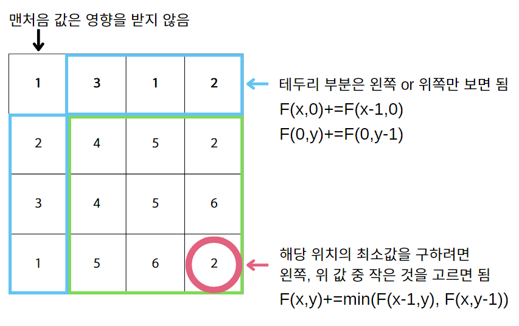

# [Min Sum Path](https://www.youtube.com/watch?v=11oqpRgDF9Q&list=PLDV-cCQnUlIa0owhTLK-VT994Qh6XTy4v&index=4)

## 💡**문제 분석 요약**

크기가 m,n인 2차원 배열의 좌측 상단(0,0)부터, 우측 하단(m-1,n-1) 까지 이동하는데, 이동 경로의 배열 값들을 모두 더하게 되는 경우, 이 값의 최소 값을 구하는 문제
또한 이동할 때, 오른쪽 아래쪽만 가능

## 💡**알고리즘 설계**


## 💡코드

```python
from typing import List  

def minPathSum(grid: List[List[int]]) -> int:
    
    h=len(grid)
    w=len(grid[0])
    
    for i in range(1,w):
        grid[0][i] += grid[0][i-1]
    
    for i in range(1,h):
        grid[i][0] += grid[i-1][0]
        
    for x in range(1,h):
        for y in range(1,w):
            grid[x][y] += min(grid[x-1][y], grid[x][y-1])
    
    return grid[h-1][w-1]

grid = [[1,3,1],[1,5,1],[4,2,1]]
print('minCost=',minPathSum(grid=grid))
```

## 💡시간복잡도
O(hw)

## 💡 틀린 이유

## 💡 다른 풀이

```python

```

## 💡 느낀점 or 기억할정보