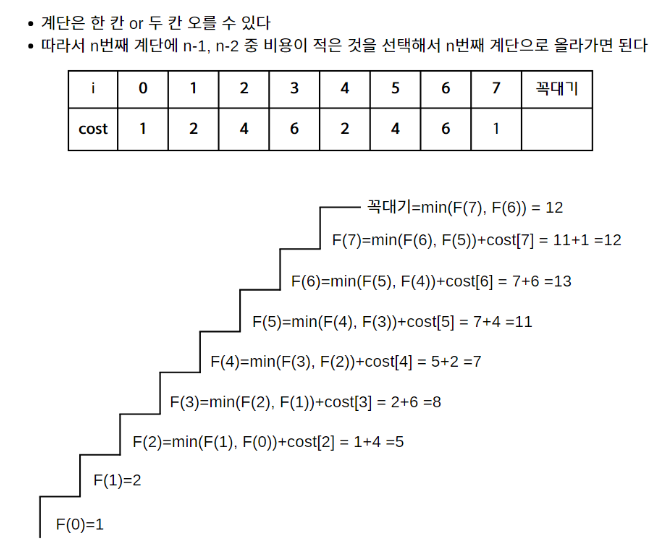

# [계단오르기](https://www.youtube.com/watch?v=lhZTYwHgrDM&list=PLDV-cCQnUlIa0owhTLK-VT994Qh6XTy4v&index=3)

## 💡**문제 분석 요약**

사람은 한번에 한 칸 혹은 두 칸의 계단을 오를 수 있다. 계단을 오르는데 필요한 비용(cost)이 있다고 가정할 때, 
꼭대기까지 오를 수 있는 최소비용을 얼마인가?

## 💡**알고리즘 설계**


## 💡코드

```python
def min_cost_climbing_stairs(cost):
    n = len(cost)
    # dp[i]는 i번째 계단까지 도달하는 데 필요한 최소 비용
    dp = [0] * (n + 1)

    # 초기값 설정
    dp[0] = cost[0]
    dp[1] = cost[1]

    # 동적 프로그래밍을 통해 각 계단까지 도달하는 데 필요한 최소 비용 계산
    for i in range(2, n + 1):
        if i == n:
            dp[i] = min(dp[i - 1], dp[i - 2])
        else:
            dp[i] = min(dp[i - 1], dp[i - 2]) + cost[i]

    # 꼭대기까지 도달하는 데 필요한 최소 비용 반환
    print(dp)
    return dp[n]

# 예시 입력
cost = [1,2,4,6,2,4,6,1]
print(min_cost_climbing_stairs(cost))
```

## 💡시간복잡도
O(n)

## 💡 틀린 이유

## 💡 다른 풀이

```python

```

## 💡 느낀점 or 기억할정보