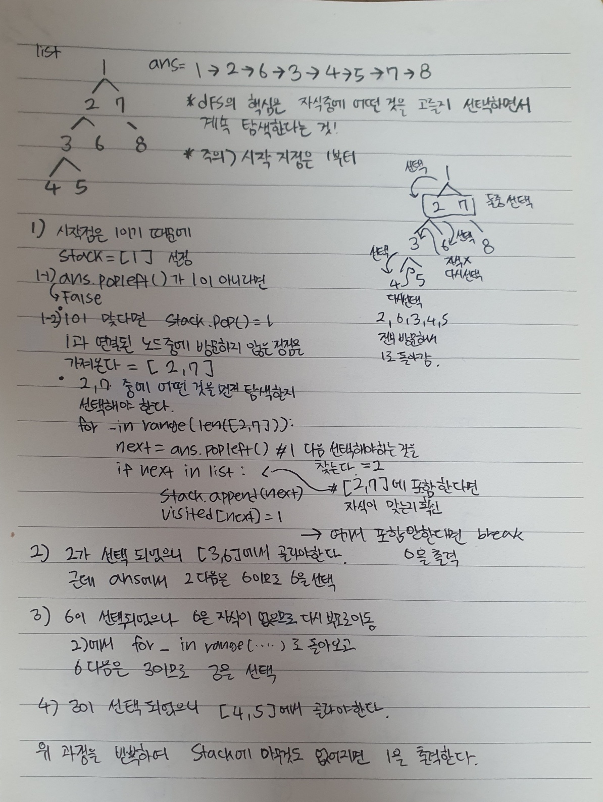

# DFS 스페셜 저지

## 💡**문제 분석 요약**

시간제한 2초
메모리제한 512MB

BOJ에서 정답이 여러가지인 경우에는 스페셜 저지를 사용한다. 
스페셜 저지는 유저가 출력한 답을 검증하는 코드를 통해서 정답 유무를 결정하는 방식이다. 오늘은 스페셜 저지 코드를 하나 만들어보려고 한다.

정점의 개수가 N이고, 정점에 1부터 N까지 번호가 매겨져있는 양방향 그래프가 있을 때, 
DFS 알고리즘은 다음과 같은 형태로 이루어져 있다.
```python
void dfs(int x) {
    if (check[x] == true) {
        return;
    }
    check[x] = true;
    // x를 방문
    for (int y : x와 인접한 정점) {
        if (check[y] == false) {
            dfs(y);
        }
    }
}
```
이 문제에서 시작 정점은 1이기 때문에 가장 처음에 호출하는 함수는 dfs(1)이다. 
DFS 방문 순서는 dfs함수에서 // x를 방문 이라고 적힌 곳에 도착한 정점 번호를 순서대로 나열한 것이다.

트리가 주어졌을 때, 올바른 DFS 방문 순서인지 구해보자.

입력

첫째 줄에 정점의 수 N(2 ≤ N ≤ 100,000)이 주어진다. 
둘째 줄부터 N-1개의 줄에는 트리의 간선 정보가 주어진다. 
마지막 줄에는 DFS 방문 순서가 주어진다. DFS 방문 순서는 항상 N개의 정수로 이루어져 있으며, 1부터 N까지 자연수가 한 번씩 등장한다.

출력

입력으로 주어진 DFS 방문 순서가 올바른 순서면 1, 아니면 0을 출력한다.

## 💡**알고리즘 설계**



## 💡코드

```python
import sys
from collections import deque
input = sys.stdin.readline

def dfs():
    n = int(input())                                        # 노드의 개수를 입력받는다.
    graph = [[] for _ in range(n+1)]                        # 양방향 그래프를 저장할 리스트다.

    for _ in range(n-1):                                    # n-1개의 간선에 대한 정보를 입력받는다.
        a, b = map(int, input().split())
        graph[a].append(b)
        graph[b].append(a)

    result = deque(list(map(int, input().split())))         # dfs 탐색 결과를 입력받는다.
    visited = [True] + [False for _ in range(n)]            # 방문 여부를 확인해줄 리스트다.

    stack = []                                              # stack을 생성하고 출발점인 1을 추가한다.
    stack.append(1)                                         

    if result.popleft() != 1:                                 # 첫 번째 원소가 1이 아니라면 0을 출력하고 함수를 종료한다.
        print(0)
        return
    visited[1] = True                                       # 1을 방문처리한다.

    while len(stack) > 0:                                   # stack의 길이가 0이 아닐 때까지 반복한다.
        now = stack.pop()                                   # stack의 원소 하나를 꺼낸다.
        next_node = []                                      # 다음에 이동할 수 있는 노드들을 저장할 리스트다.                            
        for i in graph[now]:                                # 현재 노드와 연결된 모든 노드를 탐색한다.
            if not visited[i]:                              # 해당 노드를 방문한 적이 없다면
                next_node.append(i)                         # next_node에 추가한다.
                
        for _ in range(len(next_node)):                     # next_node의 원소 개수만큼 dfs를 수행해야한다.
            next = result.popleft()                         # dfs 탐색 결과에서 확인해야할 원소를 꺼낸다.
            if next in next_node:                           # 해당 원소가 next_node에 포함된다면(현재 노드와 연결되어 있다면)
                stack.append(next)                          # stack에 next를 추가하고 방문처리한다.
                visited[next] = True                        
                break
            else:                                           # 그렇지 않다면 0을 출력하고 함수를 종료한다.
                print(0)
                return

    print(1)                                                # dfs 탐색 결과가 올바르다는 의미이므로 1을 출력한다.

dfs()

```

## 💡시간복잡도
O(V + E) 여기서 V는 정점의 수이고, E는 간선의 수
O(N^2)

## 💡 틀린 이유


## 💡 다른 풀이

```python

```

## 💡 느낀점 or 기억할정보
dfs는 자식중에서 선택해서 탐색하는지 검사하는 느낌
bfs는 자식 두개를 다 잘 선택했는지 검사하는 느낌
진심 너무 어려웠고,, 다시는 이런문제 안풀어,,