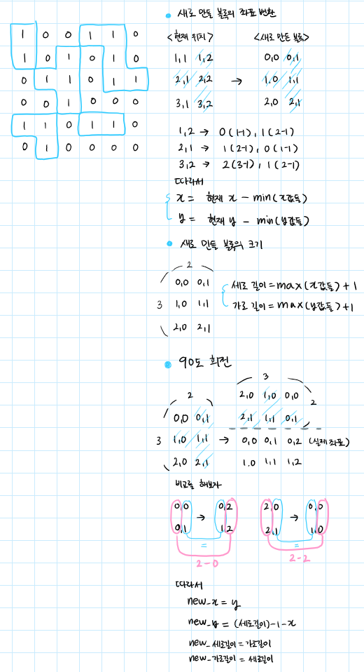

# [퍼즐 조각 채우기](https://school.programmers.co.kr/learn/courses/30/lessons/84021)

## 💡 문제

```
*문제에 그림이 많이 포함되어있으므로 문제로 이동

테이블 위에 놓인 퍼즐 조각을 게임 보드의 빈 공간에 적절히 올려놓으려 합니다. 
게임 보드와 테이블은 모두 각 칸이 1x1 크기인 정사각 격자 모양입니다. 이때, 다음 규칙에 따라 테이블 위에 놓인 퍼즐 조각을 게임 보드의 빈칸에 채우면 됩니다.

* 조각은 한 번에 하나씩 채워 넣습니다.
* 조각을 회전시킬 수 있습니다.
* 조각을 뒤집을 수는 없습니다.
* 게임 보드에 새로 채워 넣은 퍼즐 조각과 인접한 칸이 비어있으면 안 됩니다.
```

## 💡알고리즘 설계
* 핵심 아이디어는 블록을 찾으면 해당 블록에 대해 2차원배열을 만들어서 저장을 하는 것이다
  * 90도 회전이 가능하게 하기 위해
  


## 💡코드

```python
from collections import deque

def solution(game_board, table):
    # 상하좌우 이동을 위한 좌표 설정
    loc=[[-1,0],[0,1],[1,0],[0,-1]]
    h=len(game_board) # 게임 보드의 크기 (가로 또는 세로)
    puzzle=[] # 퍼즐 조각을 저장할 리스트
    empty=[] # 빈 공간을 저장할 리스트
    
    answer = 0
    
    # BFS를 통해 블록 찾기
    def bfs(origin,result: list,x,y,v,t):
        q=deque()
        q.append([x,y])
        origin[x][y]=t # 해당 좌표를 방문했다는 표시로 값을 변경
        tmp=[[x,y]] # 현재 블록의 좌표를 저장할 리스트
        
        while q:
            x,y = q.popleft()
            for i in range(4):
                nx=x+loc[i][0]
                ny=y+loc[i][1]
                if 0<=nx<h and 0<=ny<h and origin[nx][ny]==v:
                    q.append([nx, ny])
                    origin[nx][ny]=t
                    tmp.append([nx,ny])

        # 현재 블록의 최소 x, y 좌표 계산
        min_x=min(tmp, key=lambda x:x[0])[0]
        min_y= min(tmp, key=lambda x:x[1])[1]
        
        # 현재 블록의 좌표를 최소값을 기준으로 변환
        for i in range(len(tmp)):
            tmp[i][0]-=min_x
            tmp[i][1]-=min_y
            
        # 현재 블록의 최대 x, y 좌표 계산
        max_x = max(tmp, key=lambda x:x[0])[0]+1
        max_y = max(tmp, key=lambda x:x[1])[1]+1

        # 현재 블록을 표현하는 행렬 생성
        matrix=[[0]*max_y for _ in range(max_x)]

        for x,y in tmp:
            matrix[x][y]=1 # 블록이 있는 곳은 1로 표시
            
        result.append(matrix) # 퍼즐 리스트에 추가

    # 블록 회전
    def rotate(block):
        tmp=[[0]*len(block) for _ in range(len(block[0]))]
        for x in range(len(block)):
            for y in range(len(block[0])):
                tmp[y][len(block)-1-x]=block[x][y]
        return tmp
                    
    # 퍼즐과 빈 공간 찾기
    for x in range(h):
        for y in range(h):
            if table[x][y]==1: # 테이블에서 블록을 찾으면
                bfs(table, puzzle,x,y,1,0) # 해당 블록을 퍼즐 리스트에 추가
            if game_board[x][y]==0: # 게임 보드에서 빈 공간을 찾으면
                bfs(game_board, empty,x,y,0,1) # 해당 빈 공간을 empty 리스트에 추가

    # 퍼즐과 빈 공간 비교
    for i in puzzle:
        if i in empty: # 퍼즐과 빈 공간이 일치하면
            answer+=sum(k.count(1) for k in i) # 블록의 개수를 더함
            empty.remove(i) # 해당 빈 공간을 empty 리스트에서 제거
            continue
        t=i
        for _ in range(3): # 퍼즐을 회전시키며 비교
            t=rotate(t)
            if t in empty: # 회전한 퍼즐과 빈 공간이 일치하면
                answer+=sum(k.count(1) for k in i) # 블록의 개수를 더함
                empty.remove(t) # 해당 빈 공간을 empty 리스트에서 제거
                break

    return answer

# 테스트 코드
print(solution([[1,1,0,0,1,0],[0,0,1,0,1,0],[0,1,1,0,0,1],[1,1,0,1,1,1],[1,0,0,0,1,0],[0,1,1,1,0,0]],
         [[1,0,0,1,1,0],[1,0,1,0,1,0],[0,1,1,0,1,1],[0,0,1,0,0,0],[1,1,0,1,1,0],[0,1,0,0,0,0]]))
```

## 💡시간복잡도


## 💡 틀린 이유
위치와 방향을 이용했았는데 이 방법은 기준을 어디로 잡느냐에 따라 값이 달라지기 때문에 일치하는지 확인하기 어려웠다

그래서 얻은 방법이 2차원 배열에 블록 모양을 저장하는 것이다

## 💡 다른 풀이


## 💡 느낀점 or 기억할정보
블록을 2차원배열에 저장하는 것