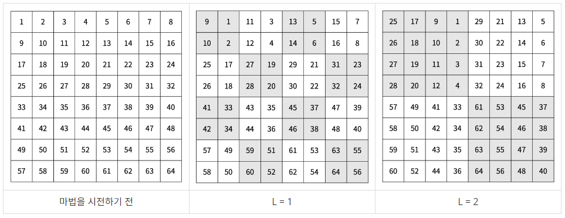
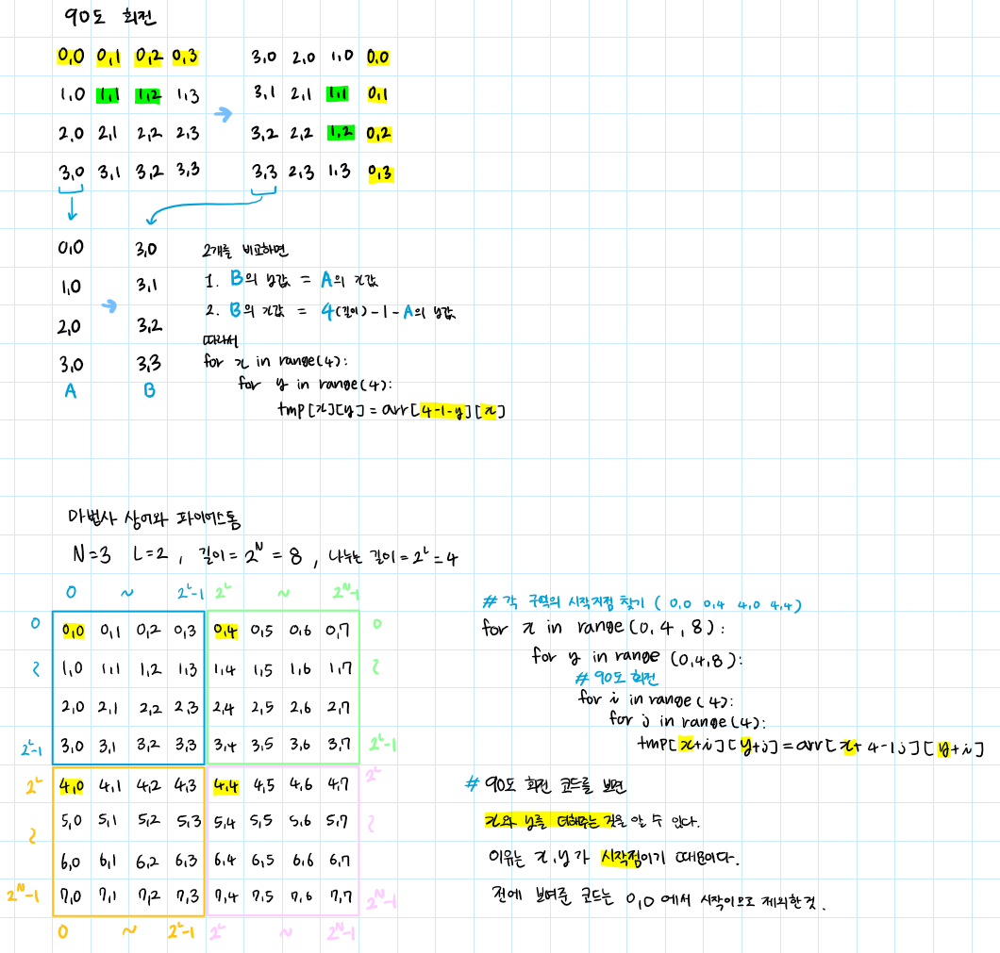

# 마법사 상어와 파이어스톰

## 💡문제 분석 요약
```
시간제한 1초
메모리 제한 512MB

마법사 상어는 파이어볼과 토네이도를 조합해 파이어스톰을 시전할 수 있다. 
오늘은 파이어스톰을 크기가 2**N x 2**N인 격자로 나누어진 얼음판에서 연습하려고 한다. 

위치 (r, c)는 격자의 r행 c열을 의미하고, 
A[r][c]는 (r, c)에 있는 얼음의 양을 의미한다. 
A[r][c]가 0인 경우 얼음이 없는 것이다.

파이어스톰을 시전하려면 시전할 때마다 단계 L을 결정해야 한다. 
파이어스톰은 먼저 격자를 2**L x 2**L 크기의 부분 격자로 나눈다. 
그 후, 모든 부분 격자를 시계 방향으로 90도 회전시킨다. 
이후 얼음이 있는 칸 3개 또는 그 이상과 인접해있지 않은 칸은 얼음의 양이 1 줄어든다. 
(r, c)와 인접한 칸은 (r-1, c), (r+1, c), (r, c-1), (r, c+1)이다. 아래 그림의 칸에 적힌 정수는 칸을 구분하기 위해 적은 정수이다.

		
마법을 시전하기 전	L = 1	L = 2
마법사 상어는 파이어스톰을 총 Q번 시전하려고 한다. 모든 파이어스톰을 시전한 후, 다음 2가지를 구해보자.

남아있는 얼음 A[r][c]의 합
남아있는 얼음 중 가장 큰 덩어리가 차지하는 칸의 개수
얼음이 있는 칸이 얼음이 있는 칸과 인접해 있으면, 두 칸을 연결되어 있다고 한다. 덩어리는 연결된 칸의 집합이다.

입력
첫째 줄에 N과 Q가 주어진다. 둘째 줄부터 2N개의 줄에는 격자의 각 칸에 있는 얼음의 양이 주어진다. 
r번째 줄에서 c번째 주어지는 정수는 A[r][c] 이다.

마지막 줄에는 마법사 상어가 시전한 단계 L1, L2, ..., LQ가 순서대로 주어진다.

출력
첫째 줄에 남아있는 얼음 A[r][c]의 합을 출력하고, 둘째 줄에 가장 큰 덩어리가 차지하는 칸의 개수를 출력한다. 
단, 덩어리가 없으면 0을 출력한다
```

## 💡문제 정리
* 전체 크기와 명령의 개수 입력
* 명령으로 L입력받음
  * 90도 회전하기
    * 2^N x 2^N 크기를 2^L x 2^L로 나누고
    * 2^L x 2^L를 90도 회전을 해준다
  * 모든 칸을 탐색하여 얼음이 있는 칸이면 상하죄우를 확인해서 얼음이 있는 칸 개수를 확인한다
    * 칸 개수가 3 이하라면 해당 칸의 얼음을 -1해준다
* 전부 끝난 후
  * 남아있는 얼음의 합 출력
  * 남아있는 얼음 중 가장 큰 덩어리가 차지하는 칸의 개수

## 💡알고리즘 설계
* 시뮬레이션이고 큰 덩어리가 차지하는 칸의 개수만 bfs로 푼다
* 90도 회전하는 법


## 💡코드

```python
import sys
from collections import deque

# 이웃한 좌표를 나타내는 리스트
loc = [[0, 1], [1, 0], [-1, 0], [0, -1]]

# 얼음 덩어리를 체크하고 녹이는 함수
def chk_ice():
    ice = []
    # 모든 좌표를 확인
    for x in range(2 ** N):
        for y in range(2 ** N):
            if A[x][y] > 0:
                cnt = 0
                # 주변 좌표를 확인하여 얼음이 있는지 세기
                for l in loc:
                    nX = x + l[0]
                    nY = y + l[1]
                    if 0 <= nX < 2 ** N and 0 <= nY < 2 ** N and A[nX][nY] > 0:
                        cnt += 1
                # 주변에 3개 미만의 얼음이 있으면 해당 좌표를 얼음 리스트에 추가
                if cnt < 3:
                    ice.append([x, y])
    # 얼음 리스트에 있는 좌표의 얼음을 1씩 줄임
    for i in ice:
        A[i[0]][i[1]] -= 1

# 얼음 덩어리를 BFS로 탐색하는 함수
def bfs(x, y):
    q = deque()
    q.append([x, y])
    visited[x][y] = 1
    cnt = 1

    while q:
        x, y = q.popleft()
        # 주변 좌표를 확인하여 방문하지 않은 얼음이 있으면 큐에 추가하고 카운트 증가
        for l in loc:
            nX = x + l[0]
            nY = y + l[1]
            if 0 <= nX < 2 ** N and 0 <= nY < 2 ** N and visited[nX][nY] == 0 and A[nX][nY] > 0:
                cnt += 1
                visited[nX][nY] = 1
                q.append([nX, nY])
    return cnt

# 입력 받기
N, Q = map(int, sys.stdin.readline().strip().split())
A = [list(map(int, sys.stdin.readline().strip().split())) for _ in range(2 ** N)]

# 각 명령어에 대해 처리
for L in map(int, sys.stdin.readline().strip().split()):
    tmp = [[0 for _ in range(2 ** N)] for _ in range(2 ** N)]
    # 각 덩어리를 시계방향으로 90도 회전하여 tmp에 저장
    for x in range(0, 2 ** N, 2 ** L):
        for y in range(0, 2 ** N, 2 ** L):
            for i in range(2 ** L):
                for j in range(2 ** L):
                    tmp[x + i][y + j] = A[x + 2 ** L - 1 - j][y + i]

    # A를 회전시킨 tmp로 업데이트하고 얼음 체크 실행
    A = tmp
    chk_ice()

# 얼음의 총합 출력
print(sum([sum(i) for i in A]))
# 가장 큰 덩어리의 개수 찾아 출력
max_cnt = 0
visited = [[0 for _ in range(2 ** N)] for _ in range(2 ** N)]
for x in range(2 ** N):
    for y in range(2 ** N):
        if visited[x][y] == 0 and A[x][y] > 0:
            max_cnt = max(max_cnt, bfs(x, y))
print(max_cnt)

```

## 💡시간복잡도
O(N^2)

## 💡 틀린 이유

## 💡 다른 풀이


## 💡 느낀점 or 기억할정보
* 얼음을 녹일 때 해당 칸을 찾자 마자 얼음을 녹여줘서 틀렸다
  * 다른 칸 검사하기 전에 녹여버려 다른 값에 영향을 줘버림
  * 그리고 얼음이 있는 칸이 3개 이하인걸 찾는 것보다 얼음 없는 칸이 2개 이상인지 확인하는게 더 빠르다고 함
* 90도 회전하기