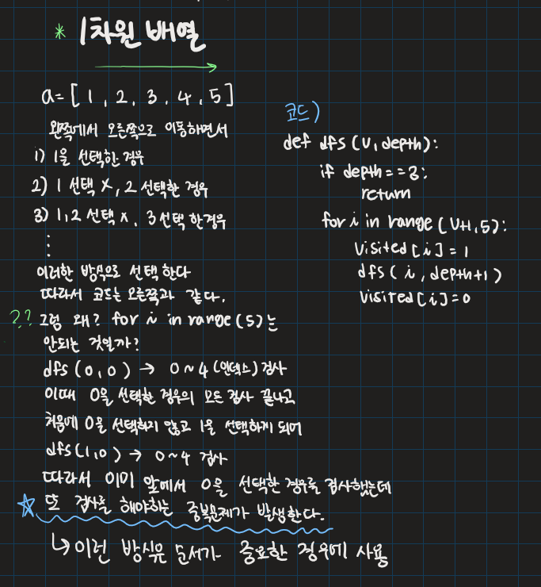

# 부르트포스
## 구현방법
1. for / while loop -> 간단한
2. 재귀함수 -> 복잡한 ex. 소수찾기 

## 주의할 점
1. 불필요한 경우의 수도 검사하고 있지는 않은지

### 중복X, 순서X, 3개 뽑기



### 재귀함수로 순열만들기
```python
# 순열을 구하는 재귀 함수 정의
def solution():
    # 배열의 길이가 N과 같아지면 반환
    if len(arr) == 3:
        return
    # N_list에 있는 원소들 중에서 아직 사용되지 않은 것을 배열에 추가하고 재귀 호출
    for i in range(5):
        if arr.count(i) < N_list.count(i): #같은 원소가 2개 이상인 것이 있다면
            arr.append(i)
            solution()
            arr.pop()

arr = []  # 순열을 저장할 배열
```

### permutation 순열
```python
"""순열이란 몇 개를 골라 순서를 고려해 나열한 경우릐 수를 말한다. 즉 서로 다른 n개 중 r개를 솔라 순서를 정해 나열하는 가짓수이다
순열은 순서를 고려하기 때문에 
[A, B, C]의 리스트에서 2개의 원소를 골라 순서를 정해 나열하면
[(A, B), (A, C), (B, A), (B, C), (C, A), (C, B)] 가 나오게 된다. 
즉 순열에서는 (A, B)와 (B, A)는 다른 것이다."""

from itertools import permutations
for i in permutations([1,2,3,4], 2):
    print(i, end=" ")

🟡중복순열
✅
for i in product([1,2,3],'ab'):
    print(i, end=" ")
(1, 'a') (1, 'b') (2, 'a') (2, 'b') (3, 'a') (3, 'b') 
✅
for i in product(range(3), range(3), range(3)):
    print(i, end=" ")
(0, 0, 0) (0, 0, 1) (0, 0, 2) (0, 1, 0) (0, 1, 1) (0, 1, 2) (0, 2, 0) (0, 2, 1) (0, 2, 2) (1, 0, 0) (1, 0, 1) (1, 0, 2) (1, 1, 0) (1, 1, 1) (1, 1, 2) (1, 2, 0) (1, 2, 1) (1, 2, 2) (2, 0, 0) (2, 0, 1) (2, 0, 2) (2, 1, 0) (2, 1, 1) (2, 1, 2) (2, 2, 0) (2, 2, 1) (2, 2, 2) 
✅
for i in product([1,2,3], repeat=2):
    print(i, end=" ")
(1, 1) (1, 2) (1, 3) (2, 1) (2, 2) (2, 3) (3, 1) (3, 2) (3, 3) 

```

### combinations 조합
```python
"""조합이란 서로 다른 n개 중에서 r개(n≥r) 취하여 조를 만들 때, 이 하나하나의 조를 n개 중에서 r개 취한 조합이라고 한다. 
조합은 순서를 고려하지 않기 때문에 [A, B, C]의 리스트에서 2개의 원소를 골라 나열하면
[(A, B), (A, C), (B, C)] 가 나오게 된다. 조합은 (A, B)와 (B, A)는 같은 것으로 취급한다."""

from itertools import combinations

for i in combinations([1,2,3,4], 2):
    print(i, end=" ")

🟡중복조합
from itertools import combinations_with_replacement

for cwr in combinations_with_replacement([1,2,3,4], 2):
    print(cwr, end=" ")

(1, 1) (1, 2) (1, 3) (1, 4) (2, 2) (2, 3) (2, 4) (3, 3) (3, 4) (4, 4)

```


### 최대 공약수와 최소 공배수
```python
def gcd(a, b):  # 최대공약수
    while b > 0:
        a, b = b, a % b
    return a


def lcm(a, b):
    return a * b / gcd(a, b)
```

### 나머지 식을 확용
```python
x==k%M and y==k%N
-> (k-x)%M==0 and (k-y)%N==0
```