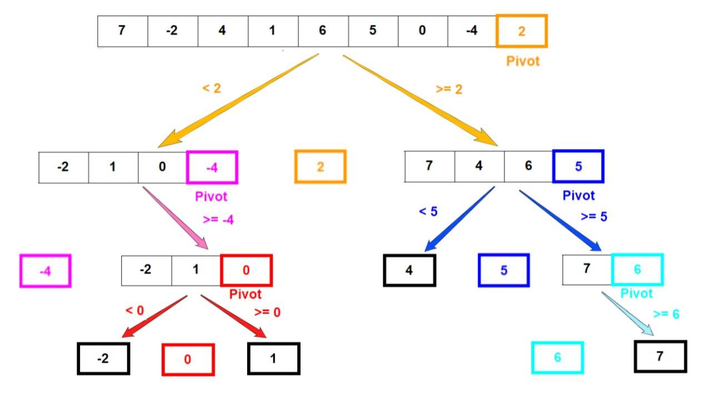

# 정렬 알고리즘
> 정렬이란 데이터를 특정한 기준에 따라 순서대로 나열하는 것을 말합니다
* 일반적으로 문제 상황에 따라서 적절한 정렬 알고리즘이 공식처럼 사용됩니다

## 선택정렬
> 처리되지 않은 데이터 중에서 ***가장 작은 데이터***
를 선택해 ***맨 앞에 있는 데이터***와 바꾸는 것을 반복합니다
### 동작
1. [7 5 9 0 3 1 6 2 4 8] 중에 작은 값을 선택
2. 0 [5 9 7 3 1 6 2 4 8] 중에 작은 값을 선택
3. 0 1 [9 7 3 5 6 2 4 8] 중에 작은 값을 선택
4. 0 1 2 [7 3 5 6 9 4 8] 중에 작은 값을 선택
5. 이것을 마지막까지 반복

```python
array = [7, 5, 9, 0, 3, 1, 6, 2, 4, 8]

for i in range(len(array)): # 0~데이터개수-1
    min_index = i
    for j in range(i+1, len(array)): # 탐색 시작
        if array[min_index] > array[j]: # 작은 원소가 있다면
            min_index = j
    array[i], array[min_index] = array[min_index], array[i]
print(array)
```

### 시간복잡도
* 선택 정렬은 N번 만큼 가장 작은 수를 찾아서 맨 앞으로 보내야 합니다
* 구현 방식에 따라서 사소한 오차는 있을 수 있지만 전체 연산 횟수는 다음과 같습니다

    N+(N-1)+(N-2)+ ... + 2 = (N^2 + N -2) / 2
* O(N^2)

<br>

## 삽입정렬
> 처리되지 않은 데이터를 하나씩 골라 ***적절한 위치에 삽입***합니다<br>선텍 정렬에 비해 구현 난이도가 높은 편이지만, 일반적으로 더 효율적으로 동작합니다

### 동작
왼쪽으로 이동하면서 비교함
1. [7 *5] 9 0 3 1 6 2 4 8 : 5를 [7]의 어디에 위치할지 선택
2. [5 7 *9] 0 3 1 6 2 4 8 : 9를 [5 7]의 어디에 위치할지 선택
3. [5 7 9 *0] 3 1 6 2 4 8 : 0를 [5 7 9]의 어디에 위치할지 선택
4. [0 5 7 9 *3] 1 6 2 4 8 : 3를 [0 5 7 9]의 어디에 위치할지 선택
    * 3과 9를 비교 3<9 이므로 스왑 [0 5 7 *3 9]
    * 3과 7를 비교 3<7 이므로 스왑 [0 5 *3 7 9]
    * 3과 5를 비교 3<5 이므로 스왑 [0 *3 5 7 9]
    * 3과 0를 비교 3>0 이므로 break
5. 이것을 마지막까지 반복

```python
array = [7, 5, 9, 0, 3, 1, 6, 2, 4, 8]

for i in range(1, len(array)):
    for j in range(i,0,-1): #  인덱스 i부터 1까지 1씩 감소하여 반복하는 문법
        #조건에 만족하면 스왑하므로 array[j]는 계속 기준 번호다
        if array[j] < array[j-1]: 
            array[j], array[j-1] = array[j-1], array[j]
        else: # 자기보다 작은 데이터를 만나면 그 위치에서 멈춤
            break
print(array)
```

### 시간복잡도
* O(N^2)
* 삽입정력은 현재 지스트의 데이터가 거의 정렬되어 있는 상태에 빠르게 동작
* 최선의 경우에는 O(N)

## 퀵 정렬
* 기준데이터를 설정하고 그 기준보다 큰 데이터와 작은 데이터의 위치를 바꾸는 방법입니다
* 일반적인 상황에서 가장 많이 사용되는 정렬 알고리즘 중 하나입니다
* 병합 정렬과 더불어 대부분의 프로그래밍 언어의 정렬 라이브러리의 근간이 되는 알고리즘입니다
* 가장 기본적인 퀵 정렬은 첫번째 데이터를 기분 데이터(pivot)로 설정합니다

### 동작
* [5, 4, 9, 0, 3, 1, 6, 2, 7, 8] start=0 end=9
* pivot은 첫번째 요소인 0을 left는 1, right는 9를 가리킨다
* left와 right가 엇가릴때까지 반복
  * left~end에서 pivot보다 큰 값을 찾음
  * right~start에서 pivot보다 작은 값을 찾음
  * 민약에 left와 right가 엇갈린다면 작은값과 pivot 스왑
    * 여기서 작은값은 right에 저장됨
  * 만약 엇갈리지 않았다면 left와 right를 스왑
* [1, 4, 2, 0, 3, *5, 6, 9, 7, 8]로 변경후
  * 엇갈려서 right와 pivot값을 스왑했기 때문에 5의 위치가 right이다
  * 따라서 right를 기준으로 [start, right-1] [right+1, end]로 나눠주고 맨 처음 부터 다시 해준다

아래 그림은 마지막 데이터를 첫번째 피벗으로 정한다


```python
array = [5, 7, 9, 0, 3, 1, 6, 2, 4, 8]

def quick_sort(array, start, end):
    if start >= end:
        return
    pivot = start #피벗 초기값은 첫번째 요소
    left = start+1
    right = end
    
    while left <= right:
        # 피벗보다 큰 데이터를 찾을 때까지 반복
        while left <= end and array[left] <= array[pivot]:
            left+=1
            
            #피벗보다 작은 데이터를 찾을 때까지 반복
        while right > start and array[right] >= array[pivot]:
            right-=1
            
        if left>right: # 엇갈렸다면 작은 right -=1 데이터와 피벗을 교체
            array[right], array[pivot] = array[pivot], array[right]
            
        else: # 엇갈리지 않았다면 작은 데이터와 큰 데이터를 교체 
            array[left], array[right] = array[right], array[left]
            
    # 분할 이후 왼쪽 부분과 오른쪽 부분에서 각각 정렬 수행
    quick_sort(array, start, right-1)
    quick_sort(array, right+1, end)
    
quick_sort(array, 0, len(array)-1)
print(array)

```
```python
array = [5, 7, 9, 0, 3, 1, 6, 2, 4, 8]

def quick_sort(array):
    
    #리스트가 하나 이하의 원소만 담고 있다면 종료
    if len(array) <= 1:
        return array
    
    pivot = array[0] # 피벗은 첫 번째 원소
    tail = array[1:] # 피벗을 제외한 리스트 
    
    left_side = [x for x in tail if x <= pivot] #분할된 왼쪽 부분
    right_side = [x for x in tail if x > pivot] #분할된 오른쪽 부분
    
    #분할 이후 왼쪽 부분과 오른쪽 부분에서 각각 정렬을 수행하고, 전체 리스트를 반환
    
    return quick_sort(left_side) + [pivot] + quick_sort(right_side)

print(quick_sort(array))
```

### 시간복잡도
* O(NlogN) : 라이브러리 사용시에는 O(NlogN)이 나오도록 설계됨
* 최선의 경우에는 O(N^2)
  * 정렬되어있는데 피벗을 첫번째로 고르는 경우

<br>

## 계수정렬
* 특정한 조건이 부합할 때만 사용할 수 있지만 매우 빠르게 동작하는 정렬 알고리즘
  * 계수 정렬은 데이터의 크기 범위가 제한되어 정수 형태로 표현할 수 있을 때 사용
* 데이터의 개수가 N, 데이터(양수) 중 최대값이 K일 때 최악의 경우에도 수행시간 O(N+K)를 보장합니다